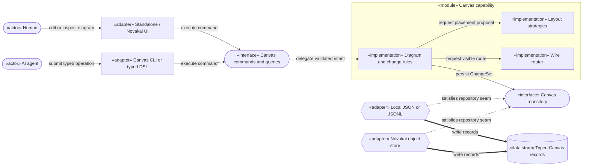
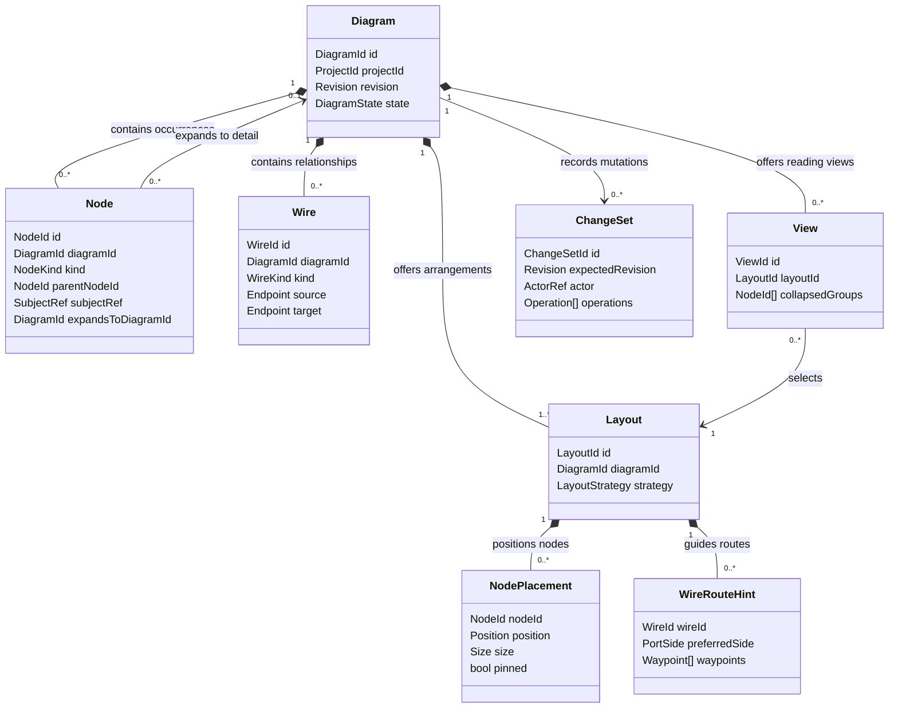
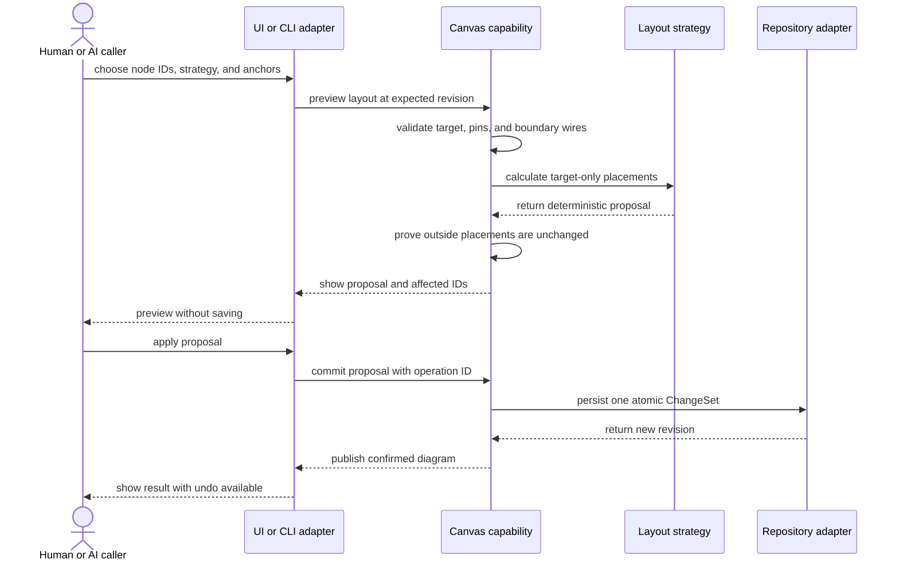

# Novakai Canvas — Product Direction and Engineering Decisions

> **Status:** Proposed agent notes — **not laws, not a ratified specification, and not authority to build**
>
> **Author:** Codex (OpenAI)
>
> **Date:** 2026-08-05 (Australia/Melbourne)
>
> **Product intent supplied by:** Christopher Dasca

This document preserves the decisions reached in the 2026-08-05 conversation so a future builder does not have to reinterpret the transcript. It deliberately separates Chris's product intent from Codex's proposed engineering decisions.

## Mission contract

**Outcome:** Leave one findable document that explains the intended Novakai Canvas product, the proposed engineering shape, the roadmap, and the finish lines well enough for another builder to continue without inventing missing meaning.

**Operating mode:** Documentation build. Make executive decisions where the conversation leaves implementation detail open. Do not ratify requirements or implement the product in this pass.

**In scope:** Product boundary; human and AI authoring model; diagram organisation; semantic, layout, routing, hierarchy, history, and integration decisions; staged roadmap; diagrams; evidence from the current repository.

**Out of scope:** Code changes, migration work, UI polish, a new Build Spec, merge to `main`, or changes to Chris's dirty working tree.

**Done means:** Authorship and status are explicit; current facts and proposals are not mixed; Chris's stated intent is preserved; the roadmap has testable milestone exits; Mermaid diagrams parse when a local renderer is available; the work is committed on an isolated branch; a temporary recovery handoff points back here.

**Fallback rule:** If detail is missing, record the smallest reversible assumption and continue. Do not hold an endless prose audit.

## Who authored what

### Christopher Dasca — product intent

The following came from Chris in the conversation on 2026-08-05. These are short verbatim statements because wording matters:

> "I want to create diagrams on the canvas."

> "I want AI to be able to create diagrams."

> "I want control over node locations, layouts."

Chris also described these expected behaviours in his own examples:

- A human can add, move, resize, edit, group, connect, reconnect, and remove things as naturally as in an ordinary canvas tool.
- AI can create useful diagrams without manually calculating every coordinate.
- Auto-layout can clean only a selected branch or group while leaving the other 95% exactly where it was.
- The canvas supports different node types, different depths of explanation, hierarchy, and clustering.
- Diagrams can be created, saved, found, revisited, and related to deeper diagrams.
- Edit and Present must not show contradictory arrangements of the same diagram.
- The useful reason Present existed — making hierarchy readable without asking AI to hand-place everything — must not be lost.

These statements are **accepted conversational direction**, not a claim that Chris authored the data model or implementation design below.

### Codex — proposed decisions

Every item labelled **Decision** in this document is Codex's proposal on 2026-08-05, derived from Chris's intent and the inspected code. Chris did not author these technical details. They remain changeable until Chris accepts them or a later specification ratifies them.

## Skills applied in this pass

- **Compile Mission Brief:** bounded the work and supplied the fallback rule above.
- **Handoff:** requires a durable recovery point and an explicit temporary handoff for a disconnected session.
- **Elite Codebase Engineering:** keeps the domain application-agnostic, defines deep public contracts, and plans migration as vertical slices.
- **Engineering Standards:** checks coupling, cohesion, separation of concerns, information hiding, dependency direction, DRY, YAGNI, least surprise, and composability.
- **Create Architecture Diagrams:** keeps proposed architecture separate from observed facts and gives every diagram a question and takeaway.

**Not applied:** Build Spec. This is intentionally a set of agent notes, not the mandatory ratified Novakai specification process.

## Current repository evidence

The isolated documentation worktree starts from `main` at commit `e020be1`. The earlier UX review also inspected the running prototype and branch at commit `31792d1`. Where branches differ, the code in `e020be1` is the repository evidence for this document.

Observed in the current worktree:

- `src/domain/model.ts` stores semantic node data and `position`/`size` in the same `ArchitectureDocument`.
- `src/domain/maps.ts` creates Present mode by running `layoutScopes` over a focused copy. Stored Edit coordinates remain unchanged.
- `src/App.tsx` chooses that derived Present document when mode is `present`.
- `src/domain/commands.ts` has one whole-scope layout command, `scope.layout`; it has no arbitrary selected-slice contract.
- `src/application/canvas-engine.ts` is already a useful framework-free seam for snapshot, command execution, persistence, and subscriptions.
- `AGENTS.md` already tells agents to use the CLI and avoid writing coordinates manually.

Plain-language diagnosis: **the app currently stores one arrangement, then Present silently creates another.** This explains why editing a layout can appear to be ignored when the user switches modes. It also shows that the CLI/automatic-layout direction is valuable and should be evolved rather than discarded.

## Product boundary

### What Novakai Canvas is

Novakai Canvas is a shared visual workspace where a human and an AI can create, understand, and revise the same structured diagrams. It is for codebase maps, system flows, operations, explanations, and related visual thinking. It runs standalone now, but its public capability should later embed in the wider Novakai application without a rewrite.

### What it is not

- It is not a Figma replacement or a pixel-perfect drawing package.
- It is not merely a Mermaid renderer.
- It is not a system where AI is expected to be good at coordinate arithmetic.
- It is not an auto-layout engine that silently takes ownership of the whole drawing.
- It is not two competing diagrams called Edit and Present.
- It is not an infinite plugin platform or every imaginable node type in the first release.
- It is not a microservice. The current need is one composable local capability with adapters.

## One-sentence product promise

**People decide what the diagram means and may place anything manually; AI describes structure through safe commands; Canvas turns that shared meaning into a readable layout without destroying intentional work.**

## Proposed decisions

All decisions in this section were authored by **Codex on 2026-08-05**. They are proposals, not Chris-authored laws.

### DEC-CANVAS-001 — One meaning, one or more saved layouts

**Decision:** Separate what a diagram means from where it happens to be drawn.

A node owns its identity, kind, words, hierarchy, and external subject reference. A wire owns the relationship and its endpoints. A layout separately owns node positions, sizes, and optional wire-routing hints. A view says which layout and display choices to use.

This ends the current Edit-versus-Present contradiction. Edit and Present must open the **same selected layout**. Present is simply read-only and removes editing chrome; it does not secretly rearrange the graph.

Multiple layouts may reference the same semantic diagram. For example, one system could have a left-to-right flow layout and a grouped ownership layout without duplicating its nodes and wires.

### DEC-CANVAS-002 — Durable objects have independent identities

**Decision:** Treat each diagram and each durable part as a typed object with a stable ID.

The target vocabulary is:

| Object | Owns |
|---|---|
| `Diagram` | Name, project placement, lifecycle, and revision |
| `Node` | Meaning, node kind, parent group, subject link, and optional deeper diagram link |
| `Wire` | Relationship kind, direction, stable source/target ports, and label |
| `Layout` | Named arrangement and its layout strategy |
| `NodePlacement` | A node's position, size, and pinned state within one layout |
| `WireRouteHint` | Optional user waypoints or preferred sides within one layout |
| `View` | A chosen layout plus filters, collapsed groups, and display preferences |
| `ChangeSet` | One atomic edit, expected revision, actor, provenance, and operations |

Each occurrence has its own ID. A node may also carry `subjectRef` so the same real module, person, process, or Novakai object can appear in more than one diagram without pretending the two drawn boxes are the same occurrence.

The file encoding is an adapter concern. JSONL is a strong fit for eventual Novakai storage because objects remain independently addressable, but UI, CLI, and domain code must depend on typed contracts rather than newline handling.

### DEC-CANVAS-003 — Humans and agents use one command contract

**Decision:** UI actions and AI/CLI actions call the same framework-free Canvas capability.

The public surface should expose commands such as:

- create, rename, duplicate, archive, restore, and delete a diagram;
- add, update, move, resize, reparent, pin, and remove a node;
- connect, reconnect, update, reroute, and remove a wire;
- create and update a group;
- preview, apply, or cancel a layout proposal;
- apply or undo one atomic batch.

Agents should normally use a compact typed DSL or CLI. They should not hand-edit stored JSON and should not need to provide coordinates. The raw record format remains inspectable for recovery, but it is not the normal authoring API.

The capability must also answer discovery queries: available node kinds, required fields, allowed wire kinds, supported layout strategies, and current revision. This lets an unfamiliar agent ask what is valid instead of guessing.

### DEC-CANVAS-004 — Human editing remains first-class

**Decision:** Automatic layout assists manual work; it does not replace it.

A human can directly add, move, resize, edit, group, connect, reconnect, reroute, and delete. Clicking empty canvas clears selection. A group's background must not steal an empty-canvas click; selecting a group uses its title, border, or an explicit control. Group padding is a user preference and may also be overridden per group.

The Inspector describes and edits whatever is selected. It should remain available in both Edit and Present; Present merely makes mutation controls read-only or hides them.

### DEC-CANVAS-005 — Layout can target a slice

**Decision:** Every layout request names its target and its anchors.

A target may be the whole diagram, one group, or an explicit set of node IDs. Nodes outside the target are immutable for that operation. Pinned target nodes are anchors. Boundary wires may be rerouted, but their outside endpoint and outside node never move.

Layout is always a proposal first:

1. choose a target and strategy;
2. calculate a deterministic preview;
3. show which placements and route hints would change;
4. apply, cancel, or adjust the selection;
5. save the accepted result as one undoable `ChangeSet`.

The critical proof is simple: applying layout to a new branch leaves every placement outside that branch byte-for-byte unchanged.

### DEC-CANVAS-006 — Wires store relationships, not renderer output

**Decision:** A wire's durable meaning is separate from the pixels used to draw it.

A wire stores a stable ID, relationship type, direction, label, and source/target node-and-port references. Reconnecting changes an endpoint through an explicit command and preserves the wire ID and history.

The router calculates the visible path. A user may save small route hints such as a preferred side or waypoint, but Canvas should not persist a large framework-specific SVG path. This keeps React Flow replaceable and lets another host render the same diagram later.

### DEC-CANVAS-007 — Groups and depth are explicit

**Decision:** Use two related mechanisms instead of forcing every depth onto one giant canvas.

- **Groups** express local clustering and modest nested hierarchy. They own a title, padding, collapse state, and parent relationship.
- **Linked detail diagrams** express deeper understanding. A node's `expandsToDiagramId` opens the diagram that explains it.

`subjectRef` tells Canvas that occurrences across diagrams describe the same real subject. `parentNodeId` says one drawn node is inside a group. `expandsToDiagramId` says where to go for more detail. These are different facts and must not be inferred from visual proximity.

### DEC-CANVAS-008 — Node types are typed but deliberately finite

**Decision:** Use a discriminated node vocabulary with runtime validation.

Each node kind owns a clear schema and inspector. Initial kinds should be driven by actual diagrams — for example module, actor, process, data store, decision, note, runtime, and group — rather than an unlimited generic property bag. New kinds are added through the public vocabulary when evidence shows they are needed.

This gives agents predictable fields and gives humans meaningful inspectors without building a speculative plugin platform.

### DEC-CANVAS-009 — AI changes are atomic, attributable, and reversible

**Decision:** One requested AI edit becomes one `ChangeSet`.

A `ChangeSet` carries a unique operation ID, expected diagram revision, actor identity, timestamp, provenance, and an ordered list of typed operations. The capability validates the whole batch, applies it all or none, and returns the new revision. Repeating the same operation ID is safe. A revision conflict produces a visible conflict instead of silently overwriting human work.

Every applied change is undoable. Preview and undo are part of the engineering contract, not later polish.

### DEC-CANVAS-010 — Organisation is a library, not a map dropdown

**Decision:** Give diagrams a findable lifecycle.

The library supports create, open, save, search, recent, favourite, project placement, unfiled, archive, restore, and recoverable trash. A diagram keeps the same ID when renamed or moved. Deep links use that ID rather than its title or file path.

The standalone application can start with a local library adapter. Future Novakai integration can project the same diagrams into Projects, Docs, Code, or Canvas without changing the core identity model.

### DEC-CANVAS-011 — Integrate through contracts, not private imports

**Decision:** Keep Canvas as one composable capability with replaceable hosts and persistence adapters.

The domain and application layers import no React, React Flow, browser, filesystem, or Novakai-shell types. The standalone web app and future Novakai shell are host adapters. Local JSON/JSONL and future Novakai object storage are repository adapters. Both hosts call the same commands and queries.

A second-host test is the proof: embedding Canvas into a small alternate host must require an adapter and composition only, with no changes to Canvas core.

## Diagrams

### How do humans, agents, and Novakai share one Canvas capability?

Scope: proposed target architecture; this is not a diagram of code already implemented.

Legend: actors request work; adapters translate a host or protocol; pill shapes are public interfaces; the module owns rules; cylinders are authoritative records; dashed arrows satisfy a seam.

Takeaway: the browser and AI do not maintain competing models. Both talk to the same Canvas contract, while layout, rendering, and storage remain replaceable.

Status: **Codex proposal, 2026-08-05.**

### Which object owns each fact?

Scope: proposed durable domain vocabulary; implementation class names may differ.

Legend: composition means the child belongs to the diagram or layout; a normal arrow is a reference. `SubjectRef` points to a real external subject without making Canvas its authority.

Takeaway: moving a box changes a placement, not the module or process the box describes. Present and Edit can therefore share meaning and choose the same layout.

Status: **Codex proposal, 2026-08-05.**

### What happens when only one messy branch needs layout?

Scope: proposed high-risk interaction for human or AI callers.

Legend: solid arrows are synchronous commands; dashed return arrows are results. The repository stores the accepted change, never the preview.

Takeaway: Canvas may clean the new branch, but it must prove that the rest of the drawing did not move before offering Apply.

Status: **Codex proposal, 2026-08-05.**

## Roadmap

This roadmap is a proposed delivery order, not authority to start every milestone. Its purpose is to prevent the foundation from blocking Chris's known future needs while still shipping in small slices.

### M0 — Direction captured (this branch)

**Deliver:** This decision record, diagrams, roadmap, evidence, and recovery handoff.

**Finish line:** A fresh builder can distinguish Chris's intent, Codex's proposals, current repository facts, and deferred choices without reading the original conversation.

### M1 — Separate meaning from layout

**Deliver:** Versioned `Diagram`, `Node`, `Wire`, `Layout`, `View`, and `ChangeSet` contracts; runtime validators; migration from the current `ArchitectureDocument`; one Canvas command/query interface shared by UI and CLI.

**Finish line:** An existing diagram migrates without losing content; moving a node changes only a layout record; UI and CLI round-trip the same facts; React/React Flow types do not enter the core.

### M2 — Complete the ordinary human canvas

**Deliver:** Diagram library; create/save/find/archive; node and group editing; wire create/reconnect/reroute; breathing-space preference; reliable empty-canvas deselection; Inspector availability; Present/Edit using the same selected layout.

**Finish line:** Chris can create and revise a complete useful diagram without touching JSON or a terminal, and switching mode never rearranges it.

### M3 — Safe layout assistance

**Deliver:** Deterministic layout strategies behind one interface; whole-diagram, group, and explicit-node targets; pins; boundary handling; preview/apply/cancel; exact undo.

**Finish line:** A test lays out a selected branch and proves every outside placement is byte-for-byte identical. The same input and strategy produce the same proposal.

### M4 — First-class AI authoring

**Deliver:** Typed DSL/CLI over the public contract; vocabulary discovery; atomic batches; expected revisions; idempotent operation IDs; preview and undo; actor/provenance records.

**Finish line:** A fresh agent can discover the vocabulary, create a multi-node diagram, add a branch, lay out only that branch, and recover from a conflict without writing coordinates or raw storage JSON.

### M5 — Depth and connected knowledge

**Deliver:** `subjectRef`, linked detail diagrams, modest nested groups, collapse state, deep links, source references, and library traversal from overview to detail.

**Finish line:** One subject can appear in several diagrams without duplicated authority, and selecting an overview node can open its deeper diagram and return safely.

### M6 — Embed in Novakai

**Deliver:** A Novakai host adapter and object-store adapter using the same public Canvas contracts as the standalone app. Connect diagrams to Projects, Docs, and Code only through typed references.

**Finish line:** A second host loads, edits, saves, and observes Canvas without changing core. Standalone and embedded hosts pass the same contract tests.

## Build order and migration rule

Use vertical slices. For each milestone:

1. add or evolve one public contract;
2. implement the rule behind it;
3. move one UI and CLI journey through it;
4. verify through the interface;
5. remove the superseded path when recovery is safe;
6. then take the next slice.

Do not build the complete future object platform before the first working slice. Do not preserve parallel old and new mutation paths indefinitely.

## Acceptance gates for future implementation

These are proposed engineering checks, not ratified product laws:

- Each durable fact has one authority.
- Runtime validation covers every external record and command.
- Domain and application layers have zero React, React Flow, browser, filesystem, or host imports.
- UI and CLI contract tests exercise the same behaviour.
- Present and Edit read the same selected `LayoutId`.
- Slice layout cannot change outside placements.
- Reconnect preserves wire identity and records endpoint history.
- Failed batches write nothing; duplicate operation IDs do not apply twice.
- Undo restores the exact prior durable state.
- Dependency-cycle checks pass.
- The second-host integration needs no Canvas-core edit.
- A future implementation claiming Novakai engineering compliance should score at least 90 with `novakai-analytics` and pass the Elite red gates.

## Deliberately deferred choices

These are not blockers for M1:

- the final node-kind catalogue;
- the visual style and exact interaction polish;
- real-time multi-user collaboration;
- cloud sync, permissions, and team sharing;
- the exact Novakai persistence envelope before that integration contract is available;
- automated staleness claims for links to code or documents.

The foundation must leave seams for these capabilities, but YAGNI applies: do not implement them without a milestone and evidence.

## Executive assumptions

- The current CLI direction is retained and evolved, not deleted.
- React Flow remains a replaceable rendering adapter unless evidence later proves it cannot support required interactions.
- Current JSON files remain readable during migration; the target domain does not commit itself to one file encoding.
- Multiple layouts are useful, but the first migration only needs one layout per existing diagram.
- Groups support modest nesting; very deep explanations move to linked diagrams.
- Chris has not ratified this document. A future builder may prototype against it only with explicit authority and must not cite it as a law.

## Verification of this documentation pass

- `git diff --check` passed.
- Mermaid CLI 11.12.0 parsed and rendered all three diagrams; the rendered PNGs were visually inspected.
- The repository's `npm run check` reached the test suite: 133 tests passed and 3 existing work-session-report publication tests failed because the checked-in report envelope/HTML does not match their expected fields and link. This branch changes documentation only and did not attempt to repair that unrelated baseline.
- The original working tree and its uncommitted user files were not modified.
