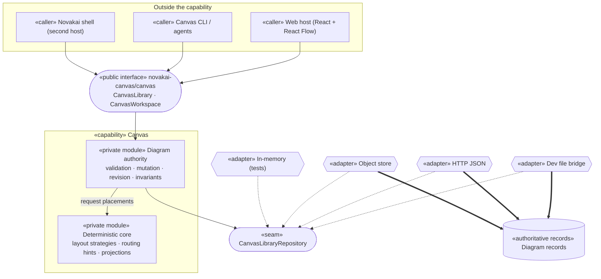
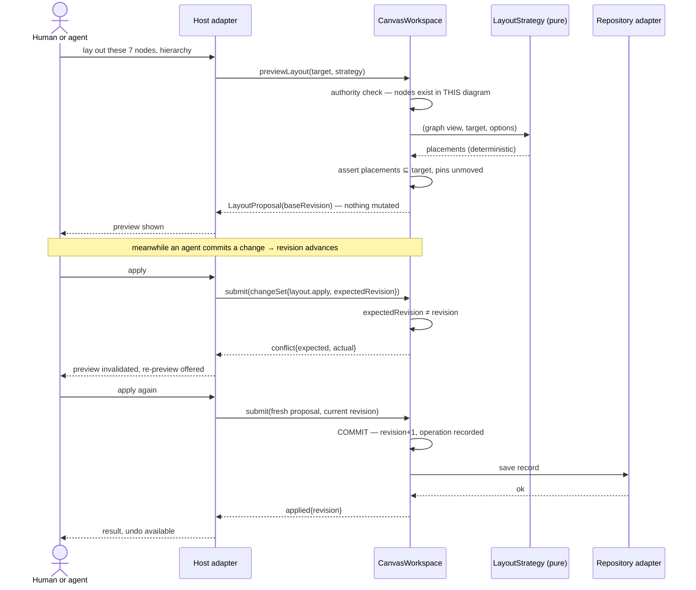

# Novakai Canvas — Capability Architecture Blueprint (Pass 1)

> **Status:** Builder decisions — **not laws, not a ratified specification.**
> Everything marked **Decision** below is the builder's proposal derived from Chris's
> requirements and inspected code. Chris authored the requirements; he did not author
> these technical choices. Any of them may be overturned.
>
> **Builder:** Claude (Anthropic)
> **Date:** 2026-08-06 (Australia/Melbourne)
> **Requirements supplied by:** Christopher Dasca
> **Branch:** `claude/canvas-record-model`
> **Predecessor:** `CANVAS-DIRECTION-NOTES.md` (Codex, 2026-08-05) — read as evidence, not authority.

---

## 0. Requirements gate — supplied by the human

Chris supplied these on 2026-08-05/06. He stated "5 is a minimum not a maximum. The
requirements named are all requirements." All seven are binding.

| ID | Requirement (Chris's words where quoted) |
|---|---|
| **R1** | *"I want to create diagrams on the canvas"* — add, move, resize, delete nodes; drag wire ends; like any ordinary canvas tool. |
| **R2** | *"I want AI to be able to create diagrams"* — without calculating coordinates. |
| **R3** | *"I want control over node locations, layouts"* — manual adjustments are saved and respected; auto-layout applies to a **slice** and provably does not move the rest. |
| **R4** | *"Can I have different node types?"* — typed nodes with their own fields and appearance. |
| **R5** | *"What is the diagram organisation system… create, save, find?"* — a real library: independent diagram records, search, archive/restore. |
| **R6** | Edit and Present must never show contradictory arrangements of the same diagram. |
| **R7** | *"I control where wires connect and roughly how they travel"* — stable ports, waypoints, reconnect preserving wire identity. |

---

## 1. Capability promise

**Canvas owns the durable meaning, arrangement, and revision of structured diagrams that
humans and agents author together — it decides what a diagram *is* and what changed, and
it does not own how any host renders it, where the bytes are stored, or who the caller is.**

The promise holds identically for the standalone web app, the CLI, an agent submitting a
change set, and a future Novakai host.

---

## 2. Consumers and composition scenarios

| Consumer | Needs | Entry point | Must NOT require | Process |
|---|---|---|---|---|
| **Web host** (current) | Open a diagram, mutate it, observe changes, save | `CanvasWorkspace` | Knowledge of storage format, file paths, migration, layout maths | In-process |
| **Canvas CLI** (`./canvas`) | Read/apply coordinate-free DSL, snapshot to SVG | `CanvasWorkspace` + `CanvasLibrary` | React, DOM, viewport, any UI concept | In-process |
| **AI agent** (via CLI or future MCP) | Discover vocabulary, submit atomic batches, recover from conflict | `describe()` + `submit()` | Coordinates, IDs it did not create, storage layout | In- or out-of-process |
| **Second host — Novakai shell** (proof) | Load, observe, edit, save through an object store | `CanvasWorkspace` + `CanvasLibraryRepository` | Vite, `public/data`, filesystem, dev-server bridge | In-process, different storage |
| **Test harness** | Drive every behaviour with no server, no browser, no disk | Same public surface + in-memory repository | Any production infrastructure | In-process |

The **second-host proof** is deliberately different from the web app in both shell *and*
storage: no filesystem, no HTTP, no React — a content-addressed object store. If that host
needs a single line changed inside `src/domain` or `src/application`, the design has failed.

---

## 3. Non-goals

Canvas will not own:

- **Rendering.** Pixel geometry, SVG paths, handle hit-boxes, animation. Hosts render.
- **Pixel-perfect drawing.** No bezier editing, no vector shapes, no typography control.
- **The truth about subjects.** A node may *reference* a code module, mission, or doc.
  Canvas never becomes the authority for that thing, and never asserts it is current.
- **Multi-user concurrency.** Optimistic revision checks only. No CRDT, no presence, no locks.
- **Storage technology.** Files, object stores, and databases are adapters.
- **Identity of callers.** Actor identity arrives from the host; Canvas records it, never mints it.
- **Layout aesthetics as policy.** Strategies are replaceable; none is privileged in the contract.

---

## 4. Elite engineering scorecard

Status legend: **S** specified (design commits to it) · **U** unproven (needs implementation
evidence) · **V** verified (evidence exists and is cited).

| Dimension | Measured by | Min | Evidence required | Status |
|---|---|---|---|---|
| Capability cohesion | One promise; no unrelated behaviour in `src/domain` + `src/application` | 4/5 | Module inventory shows no reporting/host/UI concern | S |
| Public contract quality | Every operation typed, named failures, no `any`, no leaked framework types | 5/5 | `src/canvas.ts` compiles against a host that imports nothing else | U |
| Module depth | Public surface small relative to behaviour behind it | 4/5 | Export count vs implementation LOC; analytics `interfaceClarity` green | U |
| Encapsulation | No consumer imports below the public path | 5/5 | Architecture test forbidding deep imports from host code | U |
| Composability | Two hosts, two storage adapters, zero core edits | 5/5 | Second-host contract test passes unmodified core | U |
| Domain clarity | Every durable object has id/kind/schemaVersion; branded IDs | 5/5 | Type-level test that IDs are non-interchangeable | U |
| Ownership clarity | One writer per durable fact (§10) | 5/5 | Ownership map with no shared writers | S |
| Determinism | Same graph + strategy → identical proposal | 5/5 | Repeat-run equality test | U |
| Reliability | Atomic batches; conflict visible; idempotent op IDs; exact undo | 5/5 | Failure/retry/undo tests | U |
| Security | Actor identity from host context, never payload; external input parsed from `unknown` | 4/5 | Schema-at-seam test; no caller-supplied authorship | U |
| Testability | Every behaviour reachable through the public contract without infrastructure | 5/5 | In-memory harness suite | U |
| Operability | Failures are typed and observable; no silent catch | 4/5 | analytics `swallowedErrors` = 0 | U |
| Replaceability | Renderer and storage swap without core change | 5/5 | React Flow types absent from core; two repositories | U |
| Repository navigability | Analytics ≥86 on Canvas scope; repo-wide never below 65 | 86 / 65 | `verdicts.json` per slice | U |
| Migration safety | v2 → v3 lossless on Chris's real data | 5/5 | Golden-file round-trip on the live 17-map file **and** his uncommitted working copy | U |

No implementation-quality points are claimed. Every U becomes V only with cited evidence.

---

## 5. Red gates

Any one of these rejects the architecture regardless of score.

1. Two writers for one durable fact.
2. A host or consumer imports anything below `novakai-canvas/canvas`.
3. React, React Flow, DOM, `fetch`, `fs`, or `process` types reachable from `src/domain` or `src/application`.
4. A caller-supplied field determines actor identity or authorship.
5. External JSON enters the domain without being parsed from `unknown`.
6. A silent catch, or a failure that returns success.
7. Accepted work can vanish: an applied change set that is not recoverable through undo or storage.
8. Present and Edit can resolve to different arrangements of the same diagram.
9. Slice layout moves a placement outside its declared target.
10. An interface exists without a real variability, effect, ownership, or trust boundary.
11. The second host requires a core edit.
12. A load-bearing decision is left Open while code depends on it being settled.

---

## 6. Requirements catalogue

Traceable IDs. Each states observable behaviour and a proof obligation discharged through
the public contract only.

**CAN-001 — Direct manipulation** *(R1)*
Behaviour: A human can add, move, resize, reparent, and delete a node, and the result is
durable across reload.
Proof: Drive each mutation through the public contract; reload from the repository; assert
the observed diagram matches.

**CAN-002 — Coordinate-free authoring** *(R2)*
Behaviour: A caller can create a complete diagram — nodes, groups, wires — supplying no
position or size, and receive a readable arrangement.
Proof: Submit a batch with no geometry; assert every node has a placement and no two
placements overlap.

**CAN-003 — Slice-safe layout** *(R3)*
Behaviour: Layout applied to a declared target changes placements inside the target only.
Every placement outside is byte-identical afterwards.
Proof: Serialise all placements before and after; assert equality outside the target set;
assert at least one change inside it.

**CAN-004 — Pinning outranks layout** *(R3)*
Behaviour: A pinned node inside a layout target does not move.
Proof: Pin, lay out, assert that placement unchanged.

**CAN-005 — Layout is a proposal** *(R3)*
Behaviour: A layout request returns a preview that changes nothing until explicitly applied,
and applying it is undoable as one action.
Proof: Preview, assert diagram unchanged; apply, assert changed; undo, assert byte-identical
to the pre-apply state.

**CAN-006 — Deterministic layout** *(R2, R3)*
Behaviour: Identical diagram + identical strategy + identical target → identical proposal.
Proof: Run twice, assert deep equality. No clock, no RNG, no iteration-order dependence.

**CAN-007 — Typed node kinds** *(R4)*
Behaviour: Each node kind carries its own validated fields; a kind's required fields are
discoverable before authoring.
Proof: `describe()` lists kinds and their fields; a batch violating a kind's schema is
rejected whole with a typed error naming the offending command index.

**CAN-008 — Diagram library** *(R5)*
Behaviour: A caller can create, rename, search, archive, restore, and delete a diagram, and
find it by name fragment or node label without loading every diagram's contents.
Proof: Create several; search by fragment; assert matches; archive one; assert excluded by
default and returned when explicitly requested.

**CAN-009 — Independent diagram records** *(R5)*
Behaviour: Reading or writing one diagram does not require reading or writing another.
Proof: Load one diagram from a repository whose other records are unreadable; assert success.

**CAN-010 — Stable diagram identity** *(R5)*
Behaviour: A diagram keeps its ID across rename, archive, restore, and move.
Proof: Mutate each attribute; assert ID and inbound links unchanged.

**CAN-011 — One arrangement per view** *(R6)*
Behaviour: Presenting and editing the same diagram resolve to the same layout and produce
the same placements. Mode is a host concern with no domain representation.
Proof: Assert no domain type carries a mode; assert both host paths read one layout ID and
render equal placements.

**CAN-012 — Saved viewpoint** *(R6)*
Behaviour: Viewport, collapsed groups, and selected layout persist and restore per diagram.
Proof: Set each, reload, assert restored.

**CAN-013 — Stable wire endpoints** *(R7)*
Behaviour: A wire attaches to a node or to a named port on that node; reconnecting either
end preserves the wire's ID, kind, and label.
Proof: Reconnect; assert same wire ID present with new endpoint and unchanged attributes.

**CAN-014 — Durable routing hints, not paths** *(R7)*
Behaviour: A caller can express preferred sides and waypoints; no renderer-specific path is
stored.
Proof: Assert stored routing data contains no SVG path string; assert hints survive reload.

**CAN-015 — Atomic, attributable, idempotent change** *(R2)*
Behaviour: A batch applies wholly or not at all; it records actor, timestamp, and provenance;
replaying the same operation ID does not apply twice; a stale expected revision is reported
as a conflict, not an overwrite.
Proof: Submit an invalid batch, assert zero mutation; replay an applied ID, assert
`duplicate`; submit a stale revision, assert `conflict`.

**CAN-016 — Vocabulary discovery** *(R2, R4)*
Behaviour: An unfamiliar agent can ask what node kinds, wire kinds, layout strategies,
commands, and current revision exist, and author correctly using only that answer.
Proof: Construct a valid batch using only `describe()` output; assert applied.

**CAN-017 — Second-host integration** *(R5, all)*
Behaviour: A host with different storage and no browser performs load → observe → edit →
save through the public contract.
Proof: Second-host test passes with zero changes under `src/domain` or `src/application`.

---

## 7. Load-bearing decisions

**LBD-01 — The diagram is the record boundary and the unit of revision.** *Accepted.*
Q: What is independently persisted and versioned?
Direction: `Diagram` owns its nodes, wires, interfaces, types, layouts, views, and its own
`revision`. The library is a collection of diagram records, not a document containing them.
Rationale: Chris: *"Each diagram should be independent — not one enormous file containing
every map."* It also makes conflict scope correct — an agent editing map A cannot conflict
with a human editing map B, which is exactly what happens today.
Consequences: Repository contract becomes per-record. Global `activeLayoutId` disappears.
Cross-diagram queries (subject occurrences) need the library, not one record.
Invalid if changed: §9 contract, §10 ownership, storage adapters, migration.

**LBD-02 — The diagram root scope node is dissolved into the Diagram record.** *Accepted.*
Q: Today a diagram's title lives on a top-level `scope` node, and `scope` means both "whole
map" and "group". Which survives?
Direction: `Diagram` owns `name`. Groups become `kind: 'group'`. A diagram has no root node;
its top-level nodes simply have no parent.
Exception rule: if a migrated root scope node participates in a wire, it is materialised as a
`group` node with the same ID so no relationship is lost.
Rationale: This is Codex's unfixed backbone item #2. One concept, one type.
Consequences: Migration rewrites parentage for every top-level node. `rootNodeId` disappears
from the contract.
Invalid if changed: migration, library naming, `focusArchitecture` deletion.

**LBD-03 — Layouts belong to a diagram; every diagram has at least one.** *Accepted.*
Q: Where do placements live?
Direction: `Layout` is owned by exactly one diagram, holds placements keyed by node ID,
routing hints keyed by wire ID, and a strategy name. A diagram may hold several.
Rationale: Requirement R3 and R6; today one global layout is shared by 17 diagrams, which
only works because node IDs happen to be globally unique.
Consequences: Placement lookups are always diagram-local.

**LBD-04 — `View` is a durable record; Edit/Present is a host mode with no domain type.** *Accepted.*
Q: Where do viewport, collapsed groups, and layout selection live, and how is R6 guaranteed?
Direction: `View` holds `layoutId`, viewport, collapsed group IDs, and hidden kinds. Both
host modes read the same `View`. No domain type mentions edit, present, or mode.
Rationale: R6's failure today is structural — Present *derived* a second arrangement. Deleting
the concept from the domain makes contradiction unrepresentable rather than merely discouraged.
Consequences: `presentArchitecture` and `focusArchitecture` are deleted, not adapted.

**LBD-05 — A node's interfaces are its ports.** *Accepted.*
Q: Do ports need their own record?
Direction: No. `InterfaceObject` already exists, is owned by a node, and is what Chris wants
to wire to (*"connect directly to a particular interface"*). An endpoint is
`{ nodeId, portId? }`, where `portId` is an interface ID owned by that node. Absent `portId`
means node-level attachment; the renderer chooses the side.
Rationale: YAGNI plus DRY — a parallel Port record would be a second authority for the same fact.
Consequences: Deleting an interface must nullify endpoints referencing it (degrade to
node-level, never dangle). Wire validation checks port ownership.
Invalid if changed: CAN-013, wire schema, DSL grammar.

**LBD-06 — Branded identifiers; names are never joins.** *Accepted.*
Q: How are objects addressed?
Direction: `DiagramId`, `NodeId`, `WireId`, `LayoutId`, `ViewId`, `InterfaceId` are branded
string types, mutually non-assignable. Deep links use IDs. Labels are presentation data.
Rationale: Today `listArchitectureMaps` falls back to `diagram.id` when a label is missing —
the two are already being confused at the seam.

**LBD-07 — Revision is per diagram; there is no library revision.** *Accepted.*
Q: What does `expectedRevision` refer to?
Direction: The target diagram's revision. Library-level operations (create/archive) are
revisioned per diagram record too; the library itself has no version counter.
Consequences: Change sets name their diagram. Conflict is diagram-scoped.

**LBD-08 — Migration runs once at the storage seam, and v2 is then gone.** *Accepted.*
Q: How do the existing 17 maps survive?
Direction: The repository adapter detects `schemaVersion: 2` and migrates to v3 on read. The
domain only ever sees v3. No dual-path support, no v2 writer.
Rationale: Elite rule — no compatibility museum. Migration is a one-way function tested
against Chris's real data.
Consequences: A v2 file is upgraded on first save. The pre-migration file is preserved as a
sibling backup by the file adapter (an adapter concern, not a contract promise).

**LBD-09 — Undo is a bounded per-diagram snapshot stack held by the workspace.** *Accepted.*
Q: Exact undo without an event-sourced log?
Direction: The open workspace keeps prior diagram states in memory, capped. Undo restores a
prior state and increments revision. Named versions and durable history are **deferred** (§21).
Rationale: YAGNI. R5 asks for find/save/archive, not time travel. Exactness is what CAN-005
requires, and a snapshot gives it for free.
Consequences: Undo does not survive reload. Stated as a guarantee limit, not hidden.

**LBD-10 — Layout strategies sit behind one seam and are pure.** *Accepted.*
Q: How do hierarchy/flow/manual coexist?
Direction: One `LayoutStrategy` function type: `(graph, target, options) => placements`.
Pure, deterministic, no clock, no RNG, sorted iteration. `manual` is the identity strategy.
Rationale: Real variability (R3 names several arrangements), and determinism (CAN-006) is
only checkable if the seam forbids ambient state.

**LBD-11 — The change set is the only mutation path.** *Accepted.*
Q: May the UI mutate directly for responsiveness?
Direction: No. Every mutation — human drag included — becomes a change set with actor,
provenance, and operation ID. The UI's "execute one command" convenience wraps it.
Rationale: R2 and R1 must not diverge. One contract, one audit trail, one undo semantics.
Consequences: Drag interactions coalesce into one change set on release, not per frame.

**LBD-12 — Actor identity comes from the composition root.** *Accepted.*
Q: Who says a change came from an agent?
Direction: The host supplies an `ActorContext` when opening a workspace. Change sets cannot
override it. Provenance (`ui | cli | agent | import | system`) is likewise host-declared.
Rationale: Red gate 4. Caller-supplied authorship is forgeable and worthless as an audit trail.

---

## 8. Identity and addressing model

| Concept | Durable? | Nature | Owner |
|---|---|---|---|
| `DiagramId` | Durable | Opaque branded ID, stable across rename/archive/move | Canvas |
| `NodeId`, `WireId`, `InterfaceId`, `TypeId` | Durable | Branded, unique within their diagram | Canvas |
| `LayoutId`, `ViewId` | Durable | Branded, unique within their diagram | Canvas |
| Diagram `name` | Durable | Presentation text; **never** an address | Canvas |
| `SubjectRef` | Durable reference | `{namespace, id}` pointing at an external authority | External capability |
| `SourceRef` | Durable reference | Pointer to code/doc evidence; Canvas asserts nothing about freshness | External |
| `ActorContext` | Ephemeral | Supplied per session by the host | Host |
| `OperationId` | Durable | Idempotency key recorded on the diagram | Caller-supplied, Canvas-recorded |
| Viewport / selection | Durable (viewport) / ephemeral (selection) | Viewport in `View`; selection never persisted | Canvas / Host |

Rules:

- IDs are opaque. No component of an ID carries meaning; nothing parses them.
- A node ID is unique within its diagram, not globally. Cross-diagram sameness is asserted
  only by `subjectRef` — two occurrences of the same subject are two nodes, deliberately.
- Deep links address `diagramId` (+ optional `nodeId`), never a title or path.
- Membership of a node in a group is `parentId`. Proximity implies nothing.

---

## 9. Public contract catalogue

Two public entry points. `CanvasLibrary` addresses the collection; `CanvasWorkspace` is one
opened diagram.

### Library (collection authority)

| Name | Kind | Caller | Semantics | Success | Named failures |
|---|---|---|---|---|---|
| `list` | Query | any | Library entries, active by default | `DiagramSummary[]` | — |
| `search` | Query | any | Match name and node labels without loading full records | `DiagramSummary[]` | — |
| `open` | Command | any | Open one diagram as a workspace | `CanvasWorkspace` | `diagram-not-found`, `schema-invalid` |
| `create` | Command | any | New diagram with one default layout and view | `DiagramSummary` | `diagram-already-exists` |
| `rename` | Command | any | Change display name; ID unchanged | `DiagramSummary` | `diagram-not-found` |
| `setStatus` | Command | any | active ↔ archived | `DiagramSummary` | `diagram-not-found` |
| `delete` | Command | any | Remove a record permanently | `void` | `diagram-not-found` |
| `findSubjectOccurrences` | Query | any | Every occurrence of one subject across the library | `SubjectOccurrence[]` | — |

### Workspace (one diagram's authority)

| Name | Kind | Caller | Semantics | Success | Named failures |
|---|---|---|---|---|---|
| `snapshot` | Query | any | Current diagram state | `Diagram` | — |
| `describe` | Query | agent | Vocabulary + current revision | `CanvasCapabilityDescription` | — |
| `submit` | Command | any | Apply one atomic change set | `applied{revision}` | `conflict`, `duplicate`, `rejected{commandIndex,reason}` |
| `previewLayout` | Query | any | Deterministic proposal; mutates nothing | `LayoutProposal` | `unknown-strategy`, `empty-target`, `unknown-node` |
| `undo` | Command | any | Restore the prior state exactly | `boolean` | — |
| `save` | Command | host | Persist to the repository | `void` | `save-failed` |
| `reload` | Command | host | Discard memory, re-read storage | `void` | `load-failed` |
| `subscribe` | Query | host | Observe committed changes | unsubscribe fn | — |

### Commands carried inside a change set

`node.add` · `node.update` · `node.move` · `node.resize` · `node.pin` · `node.reparent` ·
`node.setCollapsed` · `node.setSubject` · `node.setDetailDiagram` · `node.remove` ·
`wire.add` · `wire.update` · `wire.reconnect` · `wire.remove` · `wire.setRouteHint` ·
`interface.add` · `interface.update` · `interface.remove` ·
`layout.create` · `layout.apply` · `view.update`

### Events

`diagram.changed{diagramId, revision}` — a committed fact, published after the durability
boundary, carrying no payload the consumer could mistake for authority.

### Guarantee attached to every successful command

The returned revision is the diagram's new revision; the change is visible to every
subsequent query on that workspace; and it is undoable as exactly one action.

---

## 10. Ownership map

| Record / concept | Owner | Sole writer | Referenced by | Nature |
|---|---|---|---|---|
| `Diagram` (identity, name, status, revision) | Canvas | `CanvasLibrary` | Hosts, agents, links | Authoritative |
| `Node` | Canvas | `CanvasWorkspace` | Wires, placements | Authoritative |
| `Wire` | Canvas | `CanvasWorkspace` | Route hints | Authoritative |
| `Interface` (= port) | Canvas | `CanvasWorkspace` | Wire endpoints | Authoritative |
| `Type` | Canvas | `CanvasWorkspace` | Nodes, interfaces | Authoritative |
| `Layout` + `NodePlacement` | Canvas | `CanvasWorkspace` | Views, renderers | Authoritative |
| `WireRouteHint` | Canvas | `CanvasWorkspace` | Renderers | Authoritative |
| `View` | Canvas | `CanvasWorkspace` | Hosts | Authoritative |
| `AppliedOperation` | Canvas | `CanvasWorkspace` | Idempotency checks | Authoritative |
| `LayoutProposal` | Canvas | (none — value) | Hosts | **Ephemeral** |
| `PositionedNode` (node ⋈ placement) | Canvas | (none — derived) | Renderers | **Derived** |
| `DiagramSummary` | Canvas | (none — derived) | Library UI | **Derived** |
| `SubjectRef` target | **External capability** | Not Canvas | Nodes, diagrams | Foreign reference |
| `SourceRef` target | **External** | Not Canvas | Diagrams | Foreign reference |
| `ActorContext` | **Host** | Host composition root | Change sets | Foreign, ephemeral |
| Selection, hover, drag state | **Host** | Host | — | Ephemeral, never persisted |
| Presentation preferences | Canvas host config | Preferences adapter | Hosts | Authoritative, separate file |

Derived records carry no independent authority and are always recomputable from their source.

---

## 11. Guarantees

1. A successful `submit` means the change crossed the in-memory authority boundary and is
   visible to every later query; `save` moves it across the durability boundary.
2. A rejected change set mutates nothing — not one node, not one placement.
3. Replaying an operation ID never applies twice.
4. A stale expected revision produces a visible `conflict`, never a silent overwrite.
5. Layout applied to a declared target leaves every placement outside it byte-identical.
6. A pinned node inside a target does not move.
7. Preview changes nothing until applied; apply is undoable as exactly one action.
8. The same graph, strategy, and target always produce the same proposal.
9. Reconnecting a wire preserves its ID, kind, and label.
10. Removing a node removes its wires and placements — no dangling reference survives.
11. Removing an interface degrades affected endpoints to node-level — no dangling port.
12. Present and Edit read one layout; contradiction is unrepresentable.
13. Replacing the storage adapter or the renderer changes no observable contract behaviour.
14. Reading one diagram never requires another diagram to be readable.
15. **Limit, stated plainly:** undo does not survive reload (LBD-09), and Canvas never claims a
    `sourceRef` is current.

---

## 12. Invariants

Every invariant is enforced at the workspace or library boundary — the only writers.

1. Every durable object carries a unique branded ID within its diagram.
2. Every node, wire, layout, and view belongs to exactly one diagram.
3. Every diagram has at least one layout and at least one view.
4. A view's `layoutId` always resolves to a layout of the same diagram.
5. Every wire endpoint resolves to a node of the same diagram; a present `portId` resolves to
   an interface owned by that endpoint's node.
6. A node's `parentId` resolves to a `group` node of the same diagram, and the parent chain is acyclic.
7. Placements exist only for nodes of that diagram; orphan placements are impossible.
8. Actor and provenance come from the host context, never from change-set payload fields.
9. A diagram's revision increases by exactly one per applied change set.
10. An operation ID appears at most once in a diagram's applied operations.
11. No domain type names a UI mode, a framework type, a file path, or a storage concept.
12. Derived values (`PositionedNode`, `DiagramSummary`) are never persisted.

---

## 13. Capability shape



**Question:** What is inside the capability and what is merely plugged into it?
**Audience:** Builder, reviewer. **Status:** Builder proposal, 2026-08-06.
**Legend:** pill = public interface; box = module; hexagon = adapter; cylinder = authoritative
records; dashed = satisfies a seam.
**Takeaway:** Hosts and storage are outside; only two boxes are Canvas, and one of them is pure.

---

## 14. Real integration seams

Only three. Each is justified by a boundary that genuinely exists.

**S1 — `CanvasLibraryRepository`**
Responsibility: durable storage of diagram records and library listing.
Why real: environmental effects, independently replaceable infrastructure, required test
substitution, and different deployment locations (browser fetch vs Node fs vs object store).
Crossing: `DiagramId`, validated `Diagram` records, summaries. Never file paths, never URLs.
Direction: domain defines the interface; adapters depend on it.
Adapters: dev file bridge, HTTP JSON, content-addressed object store, in-memory.

**S2 — `LayoutStrategy`**
Responsibility: turning a graph and a target into placements.
Why real: genuine behavioural variability (R3 names hierarchy, flow, manual) plus a hard
determinism requirement that must be enforceable at the boundary.
Crossing: an immutable graph view, target node set, options → placements. No document, no I/O.
Direction: core depends on the type; strategies implement it.

**S3 — `ActorContext`**
Responsibility: who is acting and through what surface.
Why real: trust boundary and external ownership — identity belongs to the host, and red gate 4
depends on it never being caller-supplied.
Crossing: actor ID, actor kind, provenance source. Direction: host → capability, inbound only.

**Rejected seams** (would be ceremony): a renderer interface (Canvas renders nothing), a
migration strategy interface (exactly one migration exists), a serialization interface (the
repository already owns encoding), a clock interface (the core is pure; timestamps arrive with
the change set).

---

## 15. Integration proofs

Each must pass as a test, not as prose.

- **P1 Standalone web host** — open, mutate, save, reload, observe identical state.
- **P2 CLI without a browser** — apply DSL, read it back, snapshot to SVG; no DOM present.
- **P3 Agent round trip** — an agent using only `describe()` output composes a valid batch,
  hits a deliberate conflict, re-reads, and succeeds.
- **P4 Second host (Novakai object store)** — load → observe → edit → save with zero changes
  under `src/domain` or `src/application`. Enforced by an architecture test asserting the
  second-host suite imports only the public path.
- **P5 Adapter swap** — the identical contract suite runs green against every repository adapter.
- **P6 No-infrastructure harness** — the full behavioural suite runs with the in-memory
  repository: no server, no disk, no browser.
- **P7 Isolation** — one diagram loads from a repository whose other records throw on read.

---

## 16. Risk walkthrough — slice layout under a stale revision

The flow that tests the most decisions at once (LBD-01, LBD-07, LBD-10, LBD-11, guarantees 4/5/7/8).



**Actors:** caller, host, workspace, pure strategy, repository. **Authority check:** target
membership and pin status, inside the workspace. **Commit boundary:** the `submit` that returns
`applied`. **Observable outcome:** new revision + undo. **Failure outcome:** typed `conflict`,
nothing mutated, preview discarded. **Guarantee tested:** 4, 5, 7, 8.
**Status:** Builder proposal, 2026-08-06.

---

## 17. Repository ownership boundary

```text
src/
  canvas.ts                    PUBLIC — the only import path for any host
  domain/                      private · pure · no I/O, no framework
    ids.ts                     branded identifiers
    diagram.ts                 Diagram, Node, Wire, Interface, Type
    layout.ts                  Layout, NodePlacement, WireRouteHint, View
    change-set.ts              commands, change sets, outcomes
    invariants.ts              enforcement at the authority boundary
    schema.ts                  runtime parsing from `unknown`
    migrate/v2-to-v3.ts        one-way, one time
    strategies/                LayoutStrategy implementations (pure)
      hierarchy.ts  flow.ts  manual.ts
    projections.ts             derived views (PositionedNode, DiagramSummary)
  application/                 private · orchestration · still framework-free
    canvas-library.ts          collection authority
    canvas-workspace.ts        one diagram's authority: revision, undo, subscribe
    repository.ts              S1 seam definition
  adapters/                    outward — depend on application, never the reverse
    file-bridge-repository.ts  http-repository.ts
    object-store-repository.ts memory-repository.ts
  presentation/                web host only — may import ONLY src/canvas.ts
    ...React + React Flow...
  styles/                      grouped CSS token functions
tools/canvas-cli/              CLI host — may import ONLY src/canvas.ts
```

Enforcement: an architecture test asserts that nothing under `presentation/` or `tools/`
imports `src/domain/**` or `src/application/**` directly, and that nothing under `domain/` or
`application/` imports React, React Flow, `node:fs`, or `fetch`.

**Question:** Where is the capability boundary in the filesystem? **Audience:** builder.
**Status:** Builder proposal. **Legend:** indentation = containment; comments state the rule.
**Takeaway:** One public file; hosts physically cannot reach private code without breaking a test.

---

## 18. Delivery slices

| Slice | Capability after it | Decision exercised | Evidence | Removed | Exit condition |
|---|---|---|---|---|---|
| **V1 — Records** | One diagram loads, mutates, saves as an independent record | LBD-01, 02, 06, 07, 08 | Golden-file migration on the real 17 maps + Chris's uncommitted copy; CAN-009, 010 | `ArchitectureDocument`, `focusArchitecture`, `rootNodeId` | 17 records migrate losslessly; `npm run check` green; analytics ≥ baseline |
| **V2 — Arrangement** | Layouts and views per diagram; Present/Edit unified | LBD-03, 04 | CAN-011, 012; mode absent from domain types | `presentArchitecture`, global `activeLayoutId` | Switching mode provably cannot change placements |
| **V3 — Slice layout** | Targeted, pinned, previewed, deterministic layout | LBD-10 | CAN-003, 004, 005, 006 | old `scope.layout` whole-map path | Byte-equality proof outside target passes |
| **V4 — Ports & wires** | Wires attach to interfaces; reconnect preserves identity | LBD-05 | CAN-013, 014 | bare `source`/`target` strings | Reconnect test green; no SVG path stored |
| **V5 — Library** | Create, search, archive, restore across records | LBD-01 | CAN-008 | map dropdown backed by document scan | Search finds by node label without full load |
| **V6 — Agent authoring** | Discovery, atomic batches, conflicts, idempotency through CLI/DSL | LBD-11, 12 | CAN-015, 016, 002, 007 | direct-mutation convenience paths | Agent authors from `describe()` alone |
| **V7 — Second host** | Object-store host proves composability | LBD-01, S1 | CAN-017, P4, P5 | — | Second host runs with zero core edits |
| **V8 — Craft pass** | UI a human enjoys; quality gate met | — | Browser walkthrough screenshots; analytics ≥86 Canvas / ≥65 repo | dead exports, giant functions | Chris's standing verification rule satisfied |

Each slice ends with a commit, `npm run check`, and a recorded analytics score.

---

## 19. Traceability map

| Req | Contract operation | Owner | Guarantee / invariant | Proof | Slice |
|---|---|---|---|---|---|
| R1 | `submit`(node.*) | Workspace | G1, G2, G10 · I1, I6 | CAN-001 | V1, V2 |
| R2 | `describe`, `submit` | Workspace | G1–G4 | CAN-002, 015, 016 | V6 |
| R3 | `previewLayout`, `submit`(layout.apply), `undo` | Workspace | G5, G6, G7, G8 | CAN-003, 004, 005, 006 | V3 |
| R4 | `submit`(node.add/update), `describe` | Workspace | I1, I5 | CAN-007 | V1, V6 |
| R5 | `list`, `search`, `create`, `rename`, `setStatus`, `delete` | Library | G14 · I2 | CAN-008, 009, 010 | V1, V5 |
| R6 | `snapshot`, `submit`(view.update) | Workspace | G12 · I4, I11 | CAN-011, 012 | V2 |
| R7 | `submit`(wire.reconnect / setRouteHint) | Workspace | G9, G11 · I5 | CAN-013, 014 | V4 |
| all | second-host suite | both | G13 | CAN-017, P4 | V7 |

Every requirement reaches a proof and a slice; every operation in §9 serves a requirement;
every authoritative record in §10 has one writer.

---

## 20. ADR catalogue

| ADR | Decision recorded | Why hard to reverse | Status |
|---|---|---|---|
| ADR-001 | Diagram is the record and revision boundary | Storage layout, conflict scope, and every adapter depend on it | Accepted |
| ADR-002 | Root scope node dissolved; `group` is its own kind | Migration is one-way; old parentage is not recoverable after write | Accepted |
| ADR-003 | Interfaces are ports; no separate port record | Wire endpoint shape and DSL grammar are public | Accepted |
| ADR-004 | Edit/Present has no domain representation | Removing a domain concept later is easy; re-adding it re-opens R6 | Accepted |
| ADR-005 | Branded IDs; names never join | Touches every signature | Accepted |
| ADR-006 | v2 → v3 one-way migration, no dual path | Once written, v2 readers are gone | Accepted |
| ADR-007 | Undo is in-memory only; durable history deferred | Promising durable history later is additive, not breaking | Accepted |

---

## 21. Open-decision register

| # | Question | Options | Consequence | Owner | Blocks |
|---|---|---|---|---|---|
| O-1 | Final node-kind catalogue for R4 | Keep the 6 observed kinds + `group`; or add decision/actor/process/code-file | Adding kinds later is additive; renaming is not | Chris | V6 detail; not V1 |
| O-2 | One file per diagram, or one file holding a record map? | 17 files (true independence, noisier tree) vs one file (simpler dev bridge) | CAN-009 must hold either way; a record map satisfies it if reads are per-ID | Builder → Chris | V1 storage adapter only |
| O-3 | Durable named versions and history | Defer (LBD-09) vs build in V5 | Deferring keeps V5 small; adding later is additive | Chris | Nothing now |
| O-4 | Staleness detection for `sourceRef` | Defer; Canvas never claims freshness | Would need a code-scanning capability Canvas must not own | Chris | Nothing now |
| O-5 | Whether the CLI DSL grows port syntax in V4 or V6 | V4 (with ports) vs V6 (with agent work) | Only affects CLI ergonomics, not the contract | Builder | V4 |

**O-2 is the only one that touches V1.** Builder decision taken to keep moving: implement the
repository contract as **per-record read/write** so both encodings satisfy it, and start with a
single file holding a record map (smallest change to the dev bridge). Reversible — the contract,
not the encoding, is what CAN-009 tests.

---

## Builder test / reviewer test

A builder can implement V1–V7 from this document without asking about observable behaviour,
identity, ownership, authority, guarantees, or failure outcomes; private implementation remains
free. A reviewer can score §4, check every §5 red gate, trace every requirement through §19,
name every owner in §10, and inspect every decision in §7 — without reading implementation code.

**No implementation-quality claim is made anywhere in this document.** Every scorecard row is
`specified` or `unproven`. Evidence is produced per slice in §18 and recorded in `BUILD-LOG.md`.
